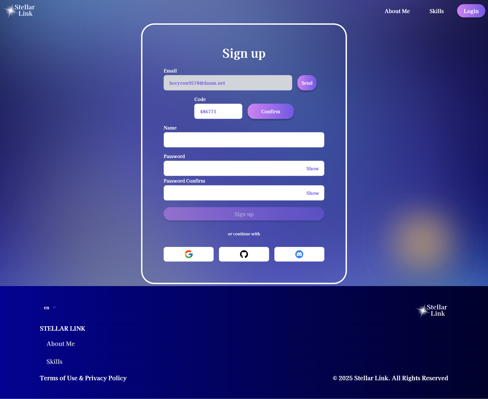
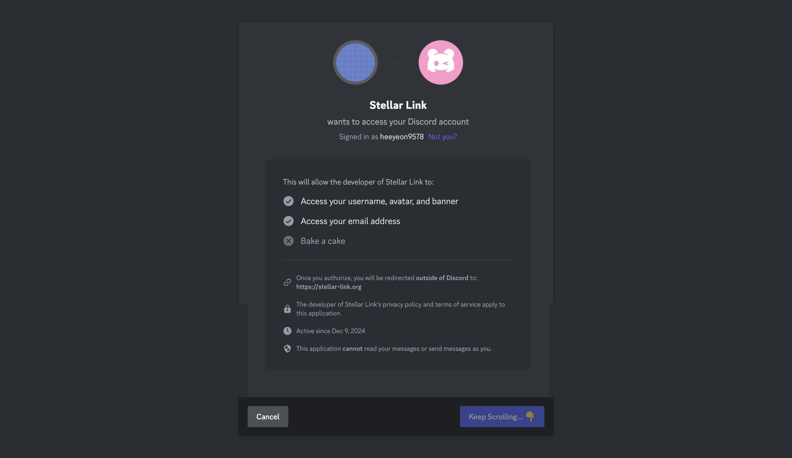
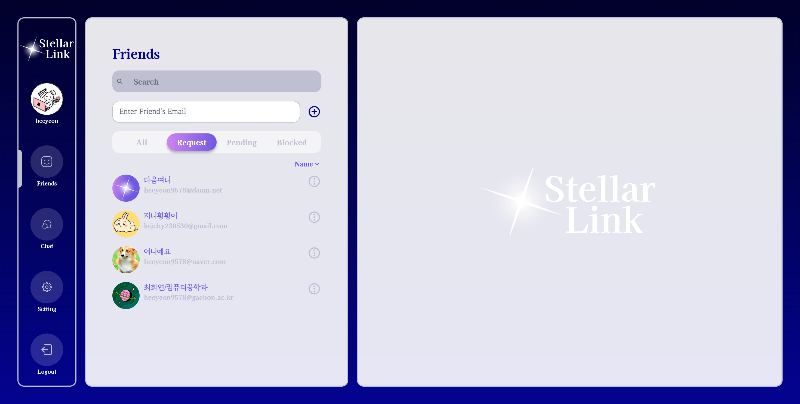
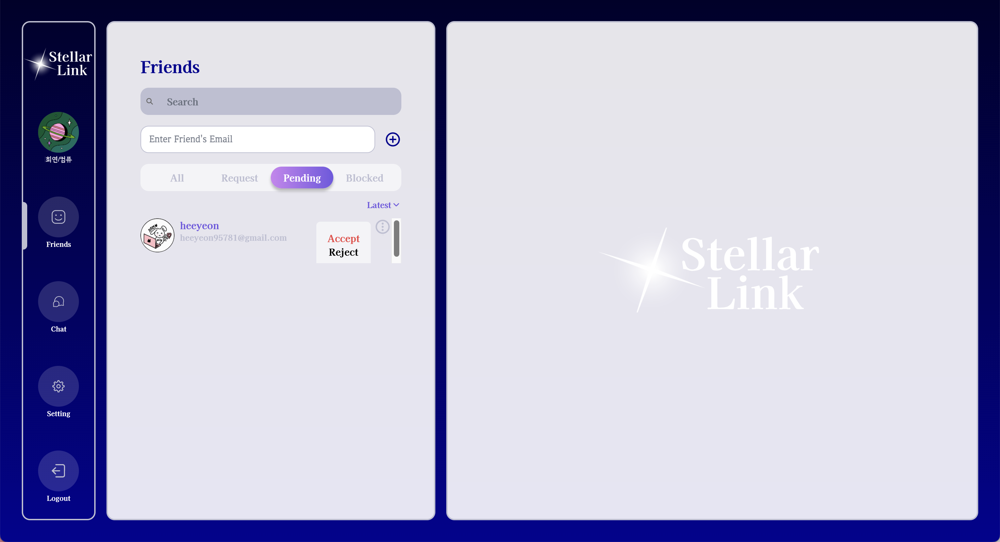
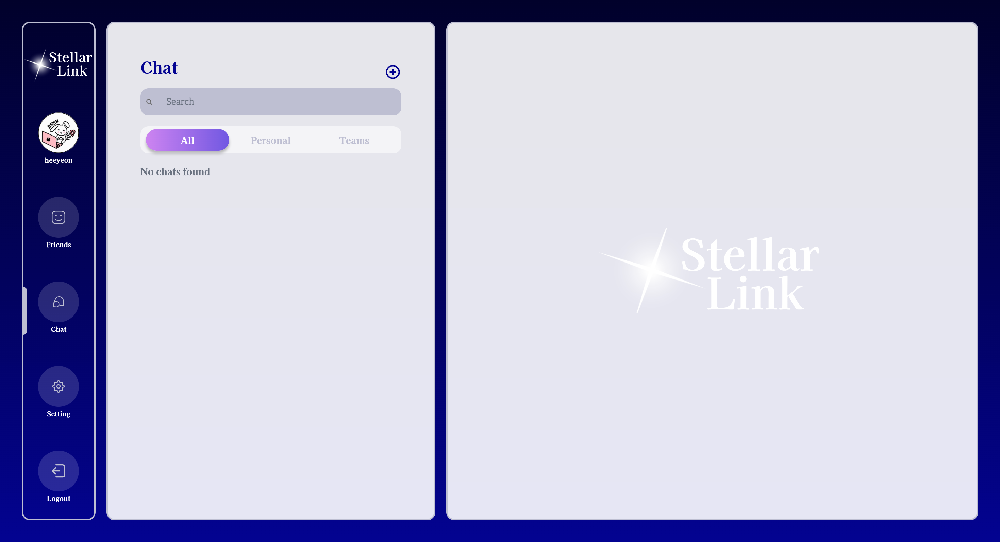

## 💫 별처럼 빛나는 관계의 연결, Stellar Link (리얼타임 채팅 애플리케이션)

> 
https://stellar-link.org/

전체화면 캡쳐할 때, 일부 애니메이션 효과로 인해 중간에 잘린 화면들이 존재합니다. 실제 사이트에서 메인화면 확인 부탁드립니다. 감사합니다.

---

## 📚 목차

- [🖥 서버 구조](#-서버-구조)
- [💻 화면 설계](#-화면-설계)
- [⚙️ 기술 스택](#-기술-스택)
- [🪄 프로젝트 상세 과정](#-프로젝트-상세-과정)
- [🛠 주요 화면 소개](#-주요-화면-소개)
  > [화면 0: 메인 화면](#화면-0-메인-화면)  
  > [화면 1: 회원가입 / 로그인 / 비밀번호 찾기 / 로그아웃 / 회원탈퇴](#화면-1-회원가입--로그인--비밀번호-찾기)  
  > [화면 2: 채팅 메인 페이지](#화면-2-채팅-메인-페이지)  

---

## 🖥 서버 구조

---

## 💻 화면 설계

 (https://www.figma.com/design/9l0M6L7W45mJAw1C6BejRn/Stellar-Link?node-id=0-1&t=jgyi0UeeH89CYrTy-1)

---

## ⚙ 기술 스택

<table>
  <thead>
    <tr>
      <th>분류</th>
      <th>스택</th>
    </tr>
  </thead>
  <tbody>
    <tr>
      <td><strong>Frontend</strong></td>
      <td>
        
        
        
        
        
        
        
      </td>
    </tr>
    <tr>
      <td><strong>Backend</strong></td>
      <td>
        
        
        
        
        
      </td>
    </tr>
  </tbody>
</table>

---

## 🪄 프로젝트 상세 과정

[Notion 으로 이동하여 프로젝트 상세 과정 보기](https://heeyeon9578.notion.site/StellarLink-24-11-29-24-02-12-14caccb87c2b80bba05bf00fa9a970f4)

---

## 🛠 주요 화면 소개

### 화면 0: 메인 화면

- **메인 페이지**: 
  

    
메인 페이지

    
    

     - 헤더, 메인, 푸터로 구성되어 있습니다.
     - 헤더에는 저에 대한 소개 페이지, 해당 웹의 기술적인 부분을 볼 수 있는 페이지, 로그인을 통해 서비스를 이용할 수 있는 버튼들이 존재합니다.
     - 메인 컨텐츠에는 서비스에 대한 소개가 담겨 있습니다.
     - 푸터에는 언어를 변경할 수 있는 버튼과 헤더와 마찬가지의 페이지들, 그리고 저작권 관련 페이지를 볼 수 있는 버튼들이 존재합니다.
       

  

---

### 화면 1: 회원가입 / 로그인 / 비밀번호 찾기

- **회원가입**: 사용자가 조건에 맞는 아이디(실존하는 이메일), 인증번호, 비밀번호, 닉네임을 입력하여 회원가입하거나, 구글/깃허브/디스코드 아이디를 통해 회원가입합니다.

   

    
회원가입 페이지

     
    

    > 회원가입 버튼을 누르면, 계정 또는 구글/깃허브/디스코드로 회원가입할 수 있는 버튼이 도출됩니다. 
 
  

  

    
로컬 회원가입 페이지

    
    
  
    > 이메일로 받은 인증번호입니다.
    
     
  
    > 이메일 인증, 사용할 비밀번호, 닉네임의 조건을 모두 만족하면 회원가입 버튼이 disable -> able 상태가 되어 클릭할 수 있습니다.
 
  

   

    
구글 회원가입 페이지

     
    

    > 구글 아이디를 클릭하여 해당 서비스에 회원가입할 수 있습니다.
    
  
  

  

    
깃허브 회원가입 페이지

     
    

    > 깃허브 아이디를 클릭하여 해당 서비스에 회원가입할 수 있습니다.
    
  
  

  

    
디스코드 회원가입 페이지

     
    

    > 디스코드 아이디를 클릭하여 해당 서비스에 회원가입할 수 있습니다.
    
  
  

- **로그인**: 사용자가 회원가입할 때 사용한 아이디(이메일)과 비밀번호를 통해 로그인합니다.

  

    
로그인 페이지

     
    

    > 로그인 버튼을 누르면, 계정 또는 구글/깃허브/디스코드로 로그인할 수 있는 버튼이 도출됩니다. 
 
  

- **비밀번호 찾기**: 사용자가 비밀번호를 잊어버렸을 경우, 가입한 이메일을 통해 새로운 비밀번호 인증코드를 받아 로그인할 수 있습니다.
  
  

    
비밀번호 찾기 페이지

   

    > 비밀번호를 찾고 싶은 아이디를 입력 후 인증번호 전송버튼을 클릭합니다.

    

    > 해당 이메일로 발송된 메일에 쓰여있는 임시 비밀번호를 사용하여 임시 로그인합니다.

  

---

### 화면 2: 채팅 메인 페이지

- **프로필 관리**: 나의 프로필 이미지, 닉네임(이름), 비밀번호를 재설정할 수 있습니다.

  

    
프로필 관리

    
     

    > 로컬 로그인일 경우, 프로필 이미지, 닉네임(이름), 비밀번호를 재설정할 수 있습니다.
    > 소셜 로그인일 경우, 프로필 이미지, 닉네임(이름)만 재설정할 수 있습니다.
    
  

- **친구 관리**: 친구를 추가, 삭제, 차단할 수 있으며 친구목록을 전체, 받은 요청, 전송한 요청, 차단한 친구로 분류하여 볼 수 있습니다.

  

    
친구 추가

    
    

    - 친구의 이메일을 작성한 후 '+' 버튼을 통해 친구요청을 전송합니다.
    - 친구요청한 내역은 'Request' 탭에 들어갑니다.
     
   

   

    
친구 전체목록

    
    

    - '친구 요청(친구 추가)'후, '상대방이 수락'하면 친구 전체목록에 나타납니다.
    - 친구를 클릭하면, 채팅방으로 바로 넘어가며 채팅방 목록에 생성됩니다.
     
   

   

    
친구 요청한 목록

    
    

    - 사용자가 '친구 추가하기'를 통해 요청한 목록을 보여줍니다.
    - 상대방이 '수락/거절'하면 목록에서 사라집니다.
     
   

   

    
친구 요청받은 목록

    
    

    - 친구 요청을 받은 목록으로, 수락/거절할 수 있습니다.
    - 수락할 경우, 친구목록으로 이동합니다.
    - 거절할 경우, 사라집니다.
      
   

   

    
친구 차단한 목록

    
    

    

    - 전체 목록에서 친구 차단하면, 차단한 목록에 나타납니다.
    - 차단해제를 통해 원상복구 혹은 친구 삭제를 통해 아예 삭제할 수 있습니다.
     
   

- **채팅**: 채팅방 생성, 개인채팅 목록 보기, 단체채팅 목록 보기, 채팅방 입장하기 등을 할 수 있습니다.
  
  

    
채팅방 생성하기

    

    > 상단의 '+' 버튼을 클릭합니다.

    

    > 채팅방에 함께할 참여자들을 선택(한 명 이상이면 가능)합니다.
    > 채팅방 생성하기 버튼을 클릭합니다.

    

    > 채팅방 생성이 완료되면 목록에 생성되며, 바로 채팅방에 입장합니다.
    
  

  

    
채팅하기

    

    > 하단의 입력창에 입력 후, 엔터 혹은 보내기 버튼을 클릭하면 채팅이 전송됩니다.
    > 첨부 파일도 전송 가능합니다.

    

    > 실시간 양방향 통신으로, 참여자가 읽을때마다 읽지 않은 참여자 수가 실시간으로 검사됩니다.
    > 채팅방에 입장하지 않았을 경우, 채팅방 목록에 읽지 않은 메세지 수가 카운팅됩니다.

    

    > 자신의 말풍선 색상 및 이름 색상을 채팅방 마다 다르게 설정할 수 있으며, 설정하자마자 다른 사용자들에게도 실시간으로 변경됩니다.
    > 서버에 저장되므로, 다시 채팅방에 입장해도 해당 컬러가 적용됩니다.
    
  

  

    
채팅방 목록 보기

    

    > 전체채팅 목록입니다.

    

    > 개인채팅 목록입니다.

    

    > 단체채팅 목록입니다.
    
  

- **설정**: 사용자가 서비스에서 로그아웃 버튼을 클릭하여 로그아웃합니다.
  
  

    
언어 설정하기

    

    > 영어, 한국어, 스페인어 중에 선택하여 설정할 수 있습니다.
    
  

  

    
테마 설정하기

    

    > 상단, 중간, 하단 색상을 자유롭게 선택하여 그라데이션을 구성할 수 있습니다.
    
  

- **로그아웃**: 사용자가 서비스에서 로그아웃 버튼을 클릭하여 로그아웃합니다.
  
  

    
로그아웃 페이지

    

    > 로그아웃 후, 메인화면으로 돌아갑니다.
    
  

---

